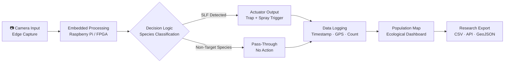

# SLF Terminator — Autonomous Invasive Species Management Rover

**ARNOLD** | Spotted Lanternfly Terminator  
*A Systems Engineering Case Study in Autonomous Hardware, Ecological Intelligence, and Scalable Pest Management*

> Developed at Loyola University Maryland · Sponsored by Dr. Yanko Kranov, Department of Engineering  
> **Lead Engineer & Architect:** Amelia Arabe | Team: Meliah Van-Otoo, Leeona Villalobos, Jeff Blevins

---

## The Mission

The Spotted Lanternfly (*Lycorma delicatula*) is one of the most destructive invasive species to reach American soil in decades. A single unchecked population threatens:

- **$324 million** in annual economic damage to Pennsylvania alone
- **2,800+ jobs** in agriculture, timber, and viticulture
- Fruit trees, vineyards, plant nurseries, and hardwood forests
- Ecosystem stability through secondary infestations of sooty mold and honeydew-attracted pests

Existing solutions — manual traps, chemical sprayers, biological controls — are reactive, imprecise, and unscalable. They require human intervention, produce collateral ecological damage, and generate no data.

**ARNOLD is different.** It is an autonomous, data-capable rover engineered to detect, contain, and eliminate Spotted Lanternflies with precision — while laying the groundwork for a future-state AI-powered ecological monitoring pipeline.

---

## System Architecture

### Hardware Stack

```
┌─────────────────────────────────────────────────────────┐
│                    SLF TERMINATOR (ARNOLD)               │
├──────────────┬──────────────────────┬───────────────────┤
│  POWER       │  CONTROL             │  ACTUATION         │
│  12V Battery │  Raspberry Pi        │  Servo Motor       │
│  5.16 Ah     │  Motion Sensors (x4) │  Insecticide Spray │
│  4hr runtime │  Camera Module       │  Line-Track Drive  │
├──────────────┴──────────────────────┴───────────────────┤
│  CAPTURE SYSTEM                                          │
│  Plexiglass Bug Trap · Peppermint Vent Ducts            │
│  Milkweed Plant (cardiac glycoside delivery)            │
│  3D-Printed Plant Holder · Magnetic-Seal Door           │
└─────────────────────────────────────────────────────────┘
```

### The Seam: Hardware-Software Integration

The SLF Terminator operates at the intersection of mechanical design and embedded systems programming — the "seam" where physical engineering meets real-time decision logic.

| Layer | Component | Function |
|---|---|---|
| Mechanical | CAD-designed plexiglass chassis | Structural integrity, trap containment |
| Fabrication | 3D-printed vents, sprayer actuator, plant holder | Precision components not commercially available |
| Embedded | Raspberry Pi with motion sensors | Autonomous path navigation, obstacle avoidance |
| Actuation | Servo motor + sprayer probe | Scheduled insecticide deployment |
| Capture | Peppermint-scented vent ducts | Passive SLF attraction and containment |
| Toxicology | Milkweed (*Asclepias*) plant | Selective lethal toxin delivery via cardiac glycosides |

### Power Architecture

```
12V Rechargeable Battery (5.16 Ah)
    ├── Rover Drive System
    ├── Raspberry Pi (motion control, camera)
    └── Servo Motor (spray actuation)

Operational Window: 4 hours continuous autonomous operation
```

### CAD & Fabrication

- **Bug Trap Body:** Laser-cut plexiglass enclosure — transparent for plant photosynthesis
- **Peppermint Vents:** 3D-printed directional ducts allowing SLF entry, preventing escape. Each vent is half-length and adjacently placed due to print bed constraints
- **Sprayer Actuator:** Custom-designed probe engineered to attach to the servo motor sprocket and toggle the insecticide spray button — iterated through multiple probe configurations to achieve consistent actuation
- **Plant Holder:** 3D-printed base securing milkweed pot during movement; removable for maintenance

---

## Phase 2: Intelligent Computer Vision Pipeline

> *The prototype proves the hardware. The pipeline proves the mission.*

ARNOLD's current architecture is a functional Iteration 1. The logical evolution — already scoped in the original design proposal — is a fully instrumented, AI-driven ecological monitoring system.

### Edge-to-Insight Architecture



### Vision System Specification (Phase 2)

| Capability | Implementation |
|---|---|
| Real-time species identification | Trained CNN classifier (MobileNet / EfficientDet) |
| SLF vs. non-target differentiation | Custom LoRA fine-tuned on SLF image datasets |
| Population counting | Object detection + frame-by-frame tracking |
| GPS-tagged heatmapping | Coordinates logged per detection event |
| Ecological export | JSON/CSV pipeline → research database |

### Why This Matters

Current pest control generates no intelligence. Every trap is a dead end — insects caught, counted manually (if at all), discarded. ARNOLD Phase 2 transforms every capture event into a data point:

- **Where** are SLF concentrations highest on the arboretum?
- **When** do populations peak — seasonally, daily?
- **What** non-target species are present and should be preserved?
- **How** is the population responding to intervention over time?

This data infrastructure is replicable. The same architecture deployed at Loyola's arboretum can scale to commercial vineyards, state parks, and agricultural research stations.

---

## Development Lifecycle

### My Role as Lead Engineer & Architect

**Program Authorship**  
Authored the original MRAF Design Proposal — defining project scope, team skill matrix, power calculations, control architecture, fabrication procedures, and societal impact framework from first principles.

**Systems Integration Leadership**  
Owned the integration layer: ensuring CAD designs were compatible with 3D print constraints, that power calculations supported all subsystems simultaneously, and that the autonomous and remote control modes did not conflict at the firmware level.

**Team Coordination**  
Ran structured team syncs throughout the development lifecycle. Managed a 4-person cross-disciplinary team across design, fabrication, programming, and wiring — distributing labor by skill while ensuring every team member gained cross-functional exposure.

**Iterative Problem-Solving**  
The sprayer actuator probe went through multiple design iterations before achieving reliable servo attachment. The vent design was restructured mid-build when 3D printer bed constraints made full-length vents impossible. Each failure was documented, analyzed, and resolved through structured redesign.

**Field Validation**  
Led end-to-end field testing at the Loyola Maryland Arboretum — validating path following, obstacle avoidance, and confirmed SLF attraction before project close.

### Project Timeline

```
Sep 2024    →    MRAF Proposal authored and submitted
Oct 2024    →    CAD design finalized, 3D printing initiated
Nov 2024    →    Hardware assembly, wiring, embedded programming
Dec 2024    →    Integration testing, sprayer probe iteration
Jan 2025    →    Field testing at Loyola Arboretum
Feb 2025    →    Final poster and demonstration delivered
```

---

## Ecological Impact Statement

The Loyola Maryland campus is a Level II accredited arboretum by the Morton Register of Arboreta — home to 2,200 trees across 114 varieties. Over two years of development, SLF presence on campus increased measurably. ARNOLD was built in direct response.

Beyond campus, the SLF threatens:
- Pennsylvania's $35B agriculture sector
- Grape, apple, hop, and hardwood industries across the Mid-Atlantic
- Biodiversity through secondary pest cascades

ARNOLD's integrated approach — passive biological attraction, selective toxin delivery, and future-state species-aware vision — positions it as an environmentally responsible alternative to broadcast pesticide application.

---

## Repository Structure

```
slf-terminator/
├── README.md
├── hardware/
│   ├── cad/                    # CAD files for chassis, vents, sprayer probe, plant holder
│   ├── schematics/             # Circuit diagrams, power architecture
│   └── bom.csv                 # Bill of materials with sourcing
├── firmware/
│   ├── autonomous_movement/    # Line-tracking + obstacle avoidance
│   ├── remote_control/         # Camera-based remote operation
│   └── spray_control/          # Servo motor + scheduled spray logic
├── docs/
│   ├── design_proposal.pdf     # Original MRAF Design Proposal
│   ├── final_poster.pdf        # Project poster presented at Loyola
│   └── power_calculations.md   # Full power budget and battery sizing
└── phase2/
    └── vision_pipeline/        # Computer vision roadmap and prototype code
```

---

## Technologies


-5C3EE8?style=flat&logo=opencv)

---

## Academic Context

**Institution:** Loyola University Maryland  
**Department:** Engineering  
**Sponsor:** Dr. Yanko Kranov  
**Classification:** Junior Design — MRAF Program  
**Field Test Site:** Loyola Maryland Arboretum (Morton Register Level II)

---

*Built to protect. Designed to scale. Engineered to learn.*
